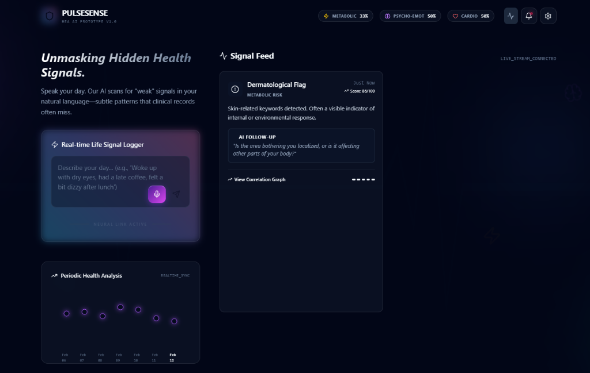
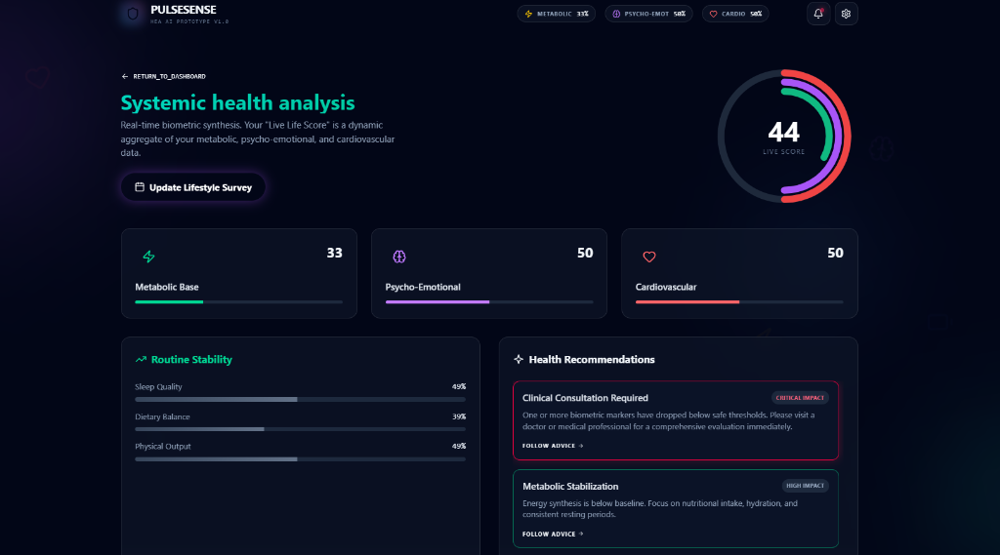

# PULSE SENSE - Decoding the Hidden Language of Your Health

**Unmasking hidden health signals through natural language.**

PULSE SENSE is a futuristic health monitoring dashboard that uses advanced AI to scan for "weak" signals in your natural language—subtle patterns that clinical records often miss. By analyzing your daily logs and voice inputs, it identifies potential metabolic, psycho-emotional, and cardiovascular risks.




## 🚀 Features

- **Natural Language Analysis**: Detects subtle health indicators from text and voice logs.
- **Tri-System Tracking**: Monitors Metabolic, Psycho-Emotional, and Cardiovascular health scores.
- **Interactive Health Dashboard**: Visualize historical data and receive AI-driven recommendations.
- **Live Health Score**: Real-time assessment based on recent inputs.
- **Systemic Health Sync**: Schedule-based reminders for regular health checkups.
- **Voice Feedback**: Integrated voice output for follow-up questions and critical alerts.

## 🛠️ Tech Stack

- **Frontend**: React 19, Vite
- **Styling**: Tailwind CSS 4, Framer Motion (Animations)
- **Icons**: Lucide React
- **Voice**: Web Speech API

## 📦 Setup & Installation

1. **Clone the repository**:
   ```bash
   git clone <repository-url>
   cd "Hea Hackathon"
   ```

2. **Install dependencies**:
   ```bash
   npm install
   ```

3. **Run the development server**:
   ```bash
   npm run dev
   ```

4. **Build for production**:
   ```bash
   npm run build
   ```

## 🧠 How it Works

Pulse Sense scans your input for "markers"—specific keywords and linguistic patterns associated with various physiological and psychological states. These markers are correlated in real-time to update your health metrics and generate proactive follow-up questions to refine the analysis.

---
*Developed for the Hea Hackathon.*
